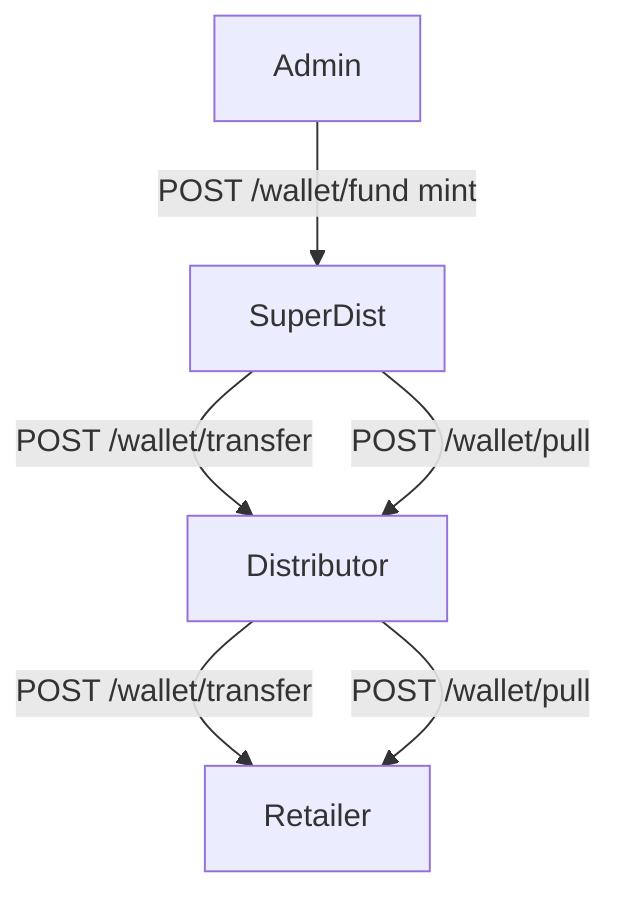

# 01 — Roles & hierarchy features

| Role | Money | Network / control | Surfaces |
|------|--------|-------------------|----------|
| **Admin** | Mint float only (`/wallet/fund`). No hierarchy transfer | Users, KYC, reassign parent, activate anyone | Admin web :3000 |
| **Super Dist** | Fund direct Distributors; Collect (Wapas) from Dist with Dist OTP | Tree, activate direct Dist, onboard Dist | Agent web + mobile |
| **Distributor** | Fund direct Retailers; Collect from Retailer with Retailer OTP | Tree, activate retailers, onboard / sponsor signup | Agent web + mobile |
| **Retailer** | Spend on services; cannot fund downline | Sees upline only | Agent web + mobile |

## Key APIs
- Fund down: `POST /api/wallet/transfer` (SD, Dist) + txn PIN
- Collect up: `POST /api/wallet/pull/request` then `/pull/confirm` + child OTP + parent PIN
- Admin mint: `POST /api/wallet/fund`
- Network: `GET /api/users/network` · Active: `PATCH /api/users/:id/active`
- Admin move: `POST /api/admin/users/:id/reassign`

## Key code
- [`apps/backend/src/modules/wallet/wallet.service.ts`](../apps/backend/src/modules/wallet/wallet.service.ts)
- [`apps/backend/src/modules/users/users.service.ts`](../apps/backend/src/modules/users/users.service.ts)
- [`apps/backend/src/modules/admin/admin.service.ts`](../apps/backend/src/modules/admin/admin.service.ts)
